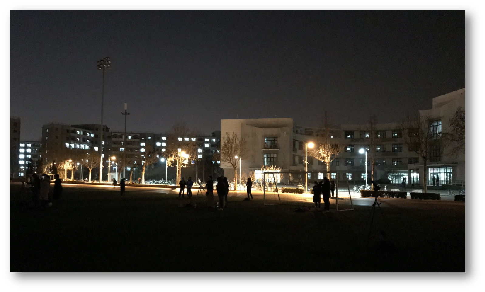

### <i class="fa fa-id-card-o fa-lg" aria-hidden="true"></i> A brief Biography
* ***Dawn-Wow Association*** 成立于2019年9月1日 起初由 ***Onion Knight*** 和 ***Rubilacxe*** 提议成立，公会名称也由二人拟定。
* 公会成立的本意是找到一群志同道合的伙伴，成立一个游戏小分队，可以比较惬意的享受游戏而不受大公会规章的约束。因此定义公会为休闲公会，由 ***Onion Knight*** 负责招人。
* 经历过一段时间的发展 ***Onion Knight*** 发现 ***穆丝*** 玩家较为活跃并且比较乐于帮助其他玩家，因此提议共同管理公会。
* 后期由于持续的 发展 陆续来了 ***抬头戳你蛋*** ***神咲诗织*** ***猜不透这结局*** ***萌姥姥*** 等人, 队伍逐渐有了一定发展，人数达到了100人左右规模。
* 而后由于 ***Onion Knight*** 在大脚频道的不懈喊话，***杨丶贼*** 联系并带领了 ***九州|休息养老俱乐部*** 公会集体并入，***晨曦公会*** 进一步发展壮大。
* 再然后，由于 ***穆丝*** 的努力，***中天不种田***  ***摇摆小猪丶*** 等人带领 ***天堂之门*** 公会集体并入 ***晨曦公会*** ，于此同时公会开始每周一次活动。
* To Be Continued

### <i class="fa fa-leaf fa-lg" aria-hidden="true"></i> 公会趣事
* 初期建立公会之时，***Onion Knight*** 本想让在练级路上认识的朋友署名，这样成立公会也更有意义。但是实践过后却发现困难重重，原因一在于组队之人多为有公会或者团体，二在于之前加过的好友因在线时间不稳定难以再联系。公会发起一天后，包括 ***Rubilacxe*** 在内仅有二人愿意签名，但是另外一人后来却中途加入其他公会，导致签名失效， ***Onion Knight*** 顿觉十分之挫败，方知万事不能随心所欲。后 ***Onion Knight*** 只得采取功利化的方法，在新人村发放包包求签名，公会才得以建立。当时签名之人要么已经退出公会要么已经AFK月余，经历此事 ***Onion Knight*** 才知看似万般简单之事也有背后的辛酸和道理，对公会管理也有了初步的认识。


有做的到的事，也有做不到的事。


* ***神咲诗织*** 为 ***Onion Knight*** 在暴风城矮人区打铁时结识。当时 ***Onion Knight*** 仅有20余级，此时大部分玩家都是肝副本和做任务。***Onion Knight*** 看到另一位20余级却来打铁之人，顿时感到此人定为有趣之人，故而斗胆上前相邀，从而结识。

* ***萌姥姥*** 是 ***Onion Knight*** 在丹莫罗练小号之时所结识。当时在侏儒新手村 ***Onion Knight*** 看到两个侏儒fs一男一女在暴打小怪，Id也极为相似。抱着路不过不错过的心态， ***Onion Knight*** 邀请了其中一位，妄想一举两得。但是而后和 ***萌姥姥*** 交谈后发现其并不认识另外一侏儒男fs，后 ***萌姥姥*** 练级速度迅猛，但是并无和 ***Onion Knight*** 共同任务副本经历，实为憾事。

* 公会第一次活动由 ***Onion Knight*** 组织并指挥，于10月5日周六晚8点开始讨伐奥妮克希亚，历经6个小时以失败告终。而后 ***Onion Knight*** 总结了此次活动之教训，有战术和战略两个方面：战术上没有重视对手，事前准备工作不足；战略上，随着游戏到达后期，我？玩游戏的心态悄然也发生了变化，公会很多人由于个人或家庭原因早就想下线，但是却碍于情面一同开荒到凌晨2点，这样游戏已经影响的现实生活，背离了休闲公会的初衷。后 ***Onion Knight*** 与 ***Rubilacxe*** 讨论至深夜，无果。


昨日种种，皆成今我，切莫思量，更莫哀，从今往后，怎么收获，怎么栽。


* ***To Be Continued***

最后提醒大家，游戏仅仅是游戏，可以作为爱好，但切莫影响正常工作和生活。下图为  ***Onion Knight*** 于2018年01月31日拍摄，只有多出去走走才能留意到身边的风景。：）


I've seen things you people wouldn't believe. Attack ships on fire off the shoulder of Orion. I've watched c-beams glitter in the dark near the Tannhauser Gate. All those...moments will be lost in time, like tears...in rain. Time to die.........


### <i class="fa fa-paper-plane fa-lg" aria-hidden="true"></i> Contact Us
---
The undemanding and proper way is sending me an *Email*
<i class="fa fa-envelope-o" aroa-hidden="true"></i> My ***Email*** address: ？？？？？？？？？？
For further communication, *wechat* is also available
<i class="fa fa-wechat" aroa-hidden="true"></i> Our ***wechat*** QR code: 

---

The end

